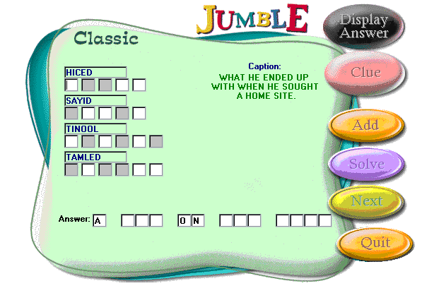



## Jumble

### Description

Jumble is a scrambled word puzzle, like those you see in your local newspaper. Unscramble 1 letter for each square to form ordinary words.

The maximum length for each scrambled word is 7 letters. The letters from the ordinary word

that will be part of the answer are highlighted. A caption is included to help solve the puzzle. The answer can vary on length and number of words. The maximum number of scrambled words is 5 and the minimum is 4.

Jumbles can be added to the database with the add feature. The Regular word is the ordinary or

unscrambled word. The scramble word is simply that the ordinary word scrambled. The final answer

column is the letters in the ordinary word that are in the answer. Example suppose you have a

word CLOTH and scrambled THLOC with LO from cloth in the final answer, the format is number of

letter in this word that are in the answer and the corresponding letter placement. In this case

you will enter 2,2,3 in the final answer column, meaning 2 letters from this word are in the

answer and those letters are in the 2nd and 3rd positions.

The answer text box is the entire answer for this jumble. The format for the final words is:

Number of words in answer, followed by any words we need to display. Example the final answer

is TO GREAT LENGTHS where TO is to be displayed, you would enter 5,1,TO in the Final Words.

Note: If you put the project into a different path make sure to change the Data1 connect object path to the jumble.mdb

Don't forget to rate this program.

Enjoy
 
### More Info
 

             |
---                |---
**Submitted On**   |2000-11-23 15:21:08
**By**             |[Mark Duhaime](https://github.com/Planet-Source-Code/PSCIndex/blob/master/ByAuthor/mark-duhaime.md)
**Level**          |Advanced
**User Rating**    |4.8 (29 globes from 6 users)
**Compatibility**  |VB 5\.0, VB 6\.0
**Category**       |[Games](https://github.com/Planet-Source-Code/PSCIndex/blob/master/ByCategory/games__1-38.md)
**World**          |[Visual Basic](https://github.com/Planet-Source-Code/PSCIndex/blob/master/ByWorld/visual-basic.md)
**Archive File**   |[CODE\_UPLOAD1198811232000\.zip](https://github.com/Planet-Source-Code/mark-duhaime-jumble__1-13059/archive/master.zip)

### API Declarations

Declared in file.

